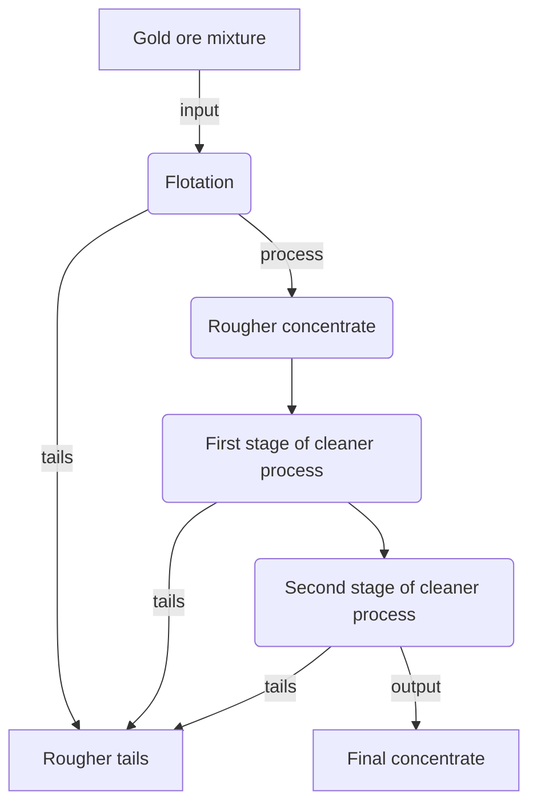
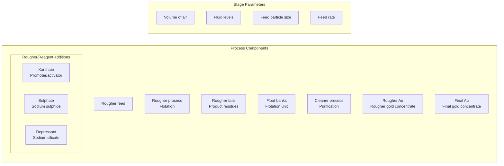
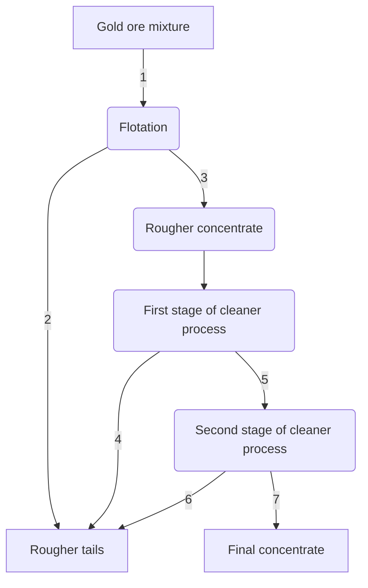

# Zyfra - Optimizaing Gold Recovery

## Site
[Zyfra - Gold Recovery Optimization](https://umbertofasci.github.io/Projects/OptimizingGoldRecovery.html)

## Introduction

In the mining industry, extracting gold from ore is a complex process that requires multiple stages of purification and refinement. The efficiency of this process, measured by the recovery rate, is crucial for both economic and environmental reasons. This project focuses on developing a machine learning model to predict the recovery rate of gold during the purification process, using data collected from various stages of a gold recovery plant.

The dataset encompasses multiple parameters measured throughout the technological process, including concentrations of different metals (Au, Ag, Pb), particle sizes, and various other features recorded at different stages of purification. These measurements are time-stamped, creating a temporal dimension to our analysis that could reveal important patterns in the recovery process.

The primary objective is to create a model that can accurately predict the recovery rate of gold, which will help optimize the purification process and reduce production costs.

The project's success will be measured using the Symmetric Mean Absolute Percentage Error (sMAPE), providing a balanced assessment of our model's predictive capabilities.


## Technological Process

In order to develop a proper workflow for optimization we must first understand what is to be optimized. In this case, understanding the technological process of gold extraction is essential.
Mined ore undergoes primary processing to get the ore mixture or rougher feed, which is the raw material for ploatation (also known as the rougher process). After flotation, the material is
sent to a two-stage purification.



### Flotation
- Gold ore mixture is fed into the float banks to obtain rougher Au concentrate and roughter `tails` (product residues with low concentration of valuable metals).
- The stability of this process is affected by the volatile and non-optimal physicochemical state of the `flotation pulp` (a mixture of solid particles and liquid). 

### Purification
- The rougher concentrate undergoes two stages of purification. After purification, the final concentrate and new tails is obtained.

### Staging & Process Components

Below are the staging and processing components associated with the technological process, these compnents are utilized as features in the final dataset.


## Data Description

Given the technological process which the features originate frome they are named in the following format:

```
[stage].[parameter_type].[parameter_name]
```
With this in mind we can take another look at the technological process where we can then infer the feature
names present in the dataset.



<div align="center">
    
| # | Feature Name |
|--------|------------|
| 1 | rougher.input.feed_au |
| 2 | rougher.output.tail_au |
| 3 | rougher.output.concentrate_au |
| 4 | primary_cleaner.output.tail_au |
| 5 | primary_cleaner.output.concentrate_au |
| 6 | secondary_cleaner.output.tail_au |
| 7 | final.tail_au |

</div>

