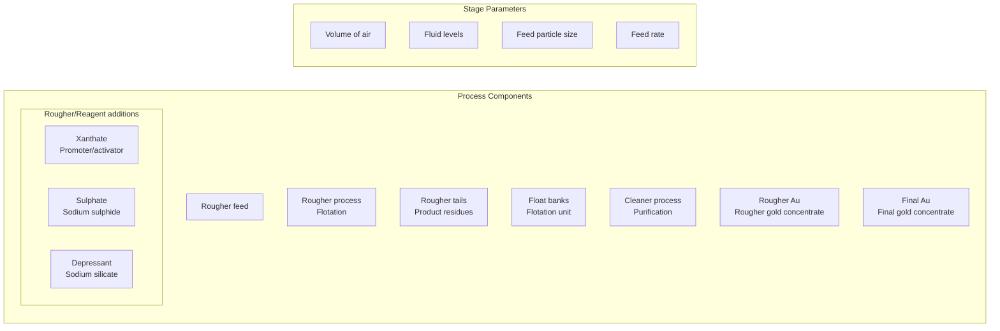
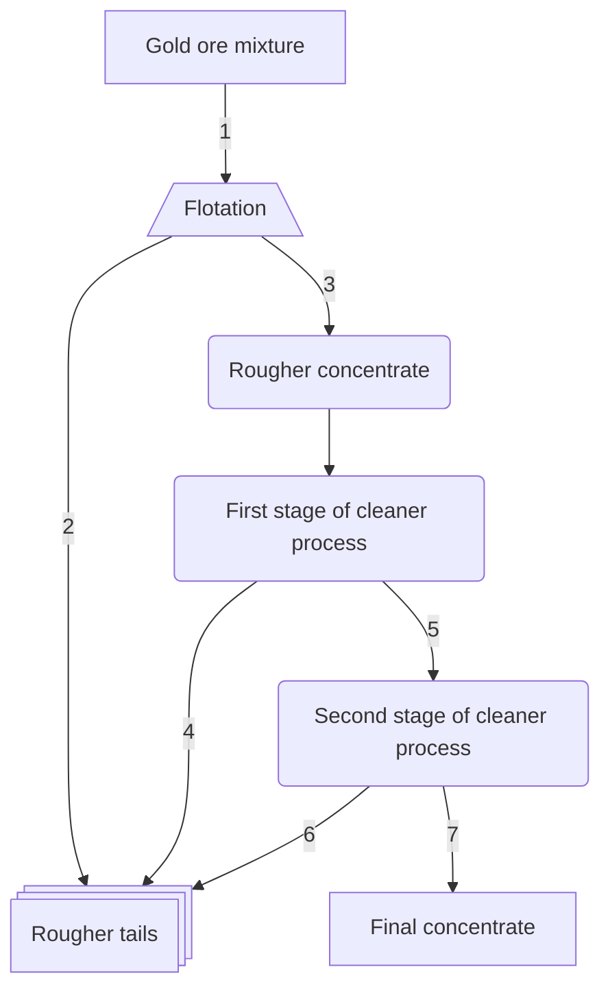

# Zyfra - Optimizing Gold Recovery

## Site
[Zyfra - Gold Recovery Optimization](https://umbertofasci.github.io/Projects/OptimizingGoldRecovery.html)

## Introduction


In the mining industry, extracting gold from ore is a complex process that requires multiple stages of purification and refinement. The efficiency of this process, measured by the recovery rate, is crucial for both economic and environmental reasons. This project focuses on developing a machine learning model to predict the recovery rate of gold during the purification process, using data collected from various stages of a gold recovery plant.

The dataset encompasses multiple parameters measured throughout the technological process, including concentrations of different metals (Au, Ag, Pb), particle sizes, and various other features recorded at different stages of purification. These measurements are time-stamped, creating a temporal dimension to our analysis that could reveal important patterns in the recovery process.

The primary objective is to create a model that can accurately predict the recovery rate of gold, which will help optimize the purification process and reduce production costs.

The project's success will be measured using the Symmetric Mean Absolute Percentage Error (sMAPE), providing a balanced assessment of our model's predictive capabilities.


## Technological Process

In order to develop a proper workflow for optimization we must first understand what is to be optimized. In this case, understanding the technological process of gold extraction is essential.
Mined ore undergoes primary processing to get the ore mixture or rougher feed, which is the raw material for ploatation (also known as the rougher process). After flotation, the material is
sent to a two-stage purification.


### Flotation
- Gold ore mixture is fed into the float banks to obtain rougher Au concentrate and roughter `tails` (product residues with low concentration of valuable metals).
- The stability of this process is affected by the volatile and non-optimal physicochemical state of the `flotation pulp` (a mixture of solid particles and liquid). 

### Purification
- The rougher concentrate undergoes two stages of purification. After purification, the final concentrate and new tails is obtained.

### Staging & Process Components

Below are the staging and processing components associated with the technological process, these compnents are utilized as features in the final dataset.


## Data Description

Given the technological process which the features originate from they are named in the following format:

```
[stage].[parameter_type].[parameter_name]
```
With this in mind we can take another look at the technological process where we can then infer the feature
names present in the dataset.



<div align="center">
    
| # | Feature Name |
|--------|------------|
| 1 | rougher.input.feed_au |
| 2 | rougher.output.tail_au |
| 3 | rougher.output.concentrate_au |
| 4 | primary_cleaner.output.tail_au |
| 5 | primary_cleaner.output.concentrate_au |
| 6 | secondary_cleaner.output.tail_au |
| 7 | final.tail_au |

</div>

## Recovery Calculation Function

In the procedure, the recovery calculation of the provided dataset is tested against one developed by myself. This is done after importing
and ingesting the data which came in three separate files: `gold_recovery_train.csv`, `gold_recovery_test.csv`, and `gold_recovery_full.csv`.

>[!NOTE]
> The downloaded data is straight from the source, and some parameters are not available becasue they were measured or calculated
> after the data was collected. That's why some features that are present in the training set may be absent from the test set. 

Now, continuing with the task at hand. The first objective with this dataset was to make sure that the recovery was calculated appropriately.
To do this, the following equation was used:

```math
Recovery = \frac{C \times (F - T)}{F \times (C - T)} \cdot 100\%
```

Where,


- $C$ — share of gold in the concentrate right after flotation (for finding the rougher concentrate recovery)/after purification (for finding the final concentrate recovery)
- $F$ — share of gold in the feed before flotation (for finding the rougher concentrate recovery)/in the concentrate right after flotation (for finding the final concentrate recovery)
- $T$ — share of gold in the rougher tails right after flotation (for finding the rougher concentrate recovery)/after purification (for finding the final concentrate recovery)

Calculating the recovery in python can be achieved with:
```python
def calculate_recovery(row, concentration_col, feed_col, tails_col):
    C = row[concentration_col]
    F = row[feed_col]
    T = row[tails_col]
    
    # Avoid division by zero
    if F == 0 or (C - T) == 0:
        return 0
    
    recovery = C * (F - T) / (F * (C - T)) * 100
    
    # Handle edge cases
    if np.isnan(recovery) or np.isinf(recovery):
        return 0
    
    return recovery
```

Applying this function to the training set:
```python
train_df['calculated_recovery'] = train_df.apply(
    lambda row: calculate_recovery(
        row,
        'rougher.output.concentrate_au',  # C
        'rougher.input.feed_au',          # F
        'rougher.output.tail_au'          # T
    ),
    axis=1
)

```
Validating the recovery calculation:
```python
valid_recovery_mask = (~train_df['rougher.output.recovery'].isna()) & (~train_df['calculated_recovery'].isna())

mae = mean_absolute_error(
    train_df.loc[valid_recovery_mask, 'rougher.output.recovery'],
    train_df.loc[valid_recovery_mask, 'calculated_recovery']

)
```
>[!NOTE]
> The `valid_recovery_mask` is created as a way to only include values that are not missing and to avoid any errors.
> Keep in mind this is being done before any initial data processing. 

### Recovery Calculation Results

The Mean Absolute Error between the calculated and the actual recovery values was found to be **`9.30e-15`**.
Considering this extremely low MAE value, effectively zero, we confirmed that the implementation of the recovery formula
matches the existing calculations in the dataset.

This near-zero difference validates both our understanding of the recovery calculation process and the reliability of
the provided data, ensuring a solid foundation for subsequent modeling efforts.

## Missing Features & Values

### Missing Test Features

To better describe what features are missing in the provided test set here is a complete list of the missing 35 features.

<details>
<summary>Click to view all missing features</summary>
    
- final.output.concentrate_ag (Type: float64)
- primary_cleaner.output.tail_pb (Type: float64)
- rougher.calculation.floatbank11_sulfate_to_au_feed (Type: float64)
- rougher.calculation.floatbank10_sulfate_to_au_feed (Type: float64)
- rougher.output.tail_sol (Type: float64)
- rougher.output.concentrate_sol (Type: float64)
- final.output.tail_ag (Type: float64)
- primary_cleaner.output.concentrate_ag (Type: float64)
- rougher.calculation.sulfate_to_au_concentrate (Type: float64)
- rougher.output.tail_pb (Type: float64)
- primary_cleaner.output.tail_ag (Type: float64)
- calculated_recovery (Type: float64)
- rougher.calculation.au_pb_ratio (Type: float64)
- secondary_cleaner.output.tail_sol (Type: float64)
- secondary_cleaner.output.tail_au (Type: float64)
- secondary_cleaner.output.tail_pb (Type: float64)
- primary_cleaner.output.concentrate_sol (Type: float64)
- final.output.concentrate_sol (Type: float64)
- primary_cleaner.output.tail_au (Type: float64)
- final.output.tail_sol (Type: float64)
- rougher.output.recovery (Type: float64)
- primary_cleaner.output.concentrate_au (Type: float64)
- rougher.output.concentrate_au (Type: float64)
- rougher.output.tail_ag (Type: float64)
- final.output.concentrate_pb (Type: float64)
- final.output.concentrate_au (Type: float64)
- final.output.tail_au (Type: float64)
- rougher.output.concentrate_ag (Type: float64)
- primary_cleaner.output.concentrate_pb (Type: float64)
- secondary_cleaner.output.tail_ag (Type: float64)
- rougher.output.concentrate_pb (Type: float64)
- rougher.output.tail_au (Type: float64)
- final.output.recovery (Type: float64)
- final.output.tail_pb (Type: float64)
- primary_cleaner.output.tail_sol (Type: float64)

</details>

An easy way to obtain this list of missing features in the test set that are present in the training is to utilize the `set()` functionality:

```python
train_columns = set(train_df.columns)
test_columns = set(test_df.columns)

missing_in_test = train_columns - test_columns
```

### Missing Values

Here we highlight the inherent challenges in industrial process data collection. The training set exhibits 85 columns with missing values, with significant gaps in final output measurements
and recovery data, notably 1,521 missing values in final output recovery. State measurements such as floatbank levels and air parameters show consistent patterns of 85 - 103 mising entries.
The test set demonstrates a more extensive pattern of missing values, particularly in input and state parameters. While floatbank state measurements chonsistently express around 16 missing
values, chemical input measurements display higher variability in missing data, randing from 166 to 353 missing values for xanthate measurements and up to 302 for sulfate readings. Feed
measurements also show varying degrees of missingness across different parameters.

### Missing Data Imputation

#### Bi-Directional Rolling Average Interpolation

In this section an experiment in filling time-series-like data is performed targeting several methodologies and data leakage. While dropping the values was
an option, at this point I wanted to try and maintain the temporal effects of the dataset. The first approach that was made was to conduct a **rolling average interpolation**.
This interpolation formula creates a bidirectional moving average by computing both forward and backward rolling means with a specified window size, then averages these two
directions to produce more balanced estimates.

```math
Combined  Average(t) = \frac{1}{2} (\frac{\sum_{i=t}^{t+w} X_{i}}{w} + \frac{\sum_{i=t-w}^{t} X_{i}}{w})
```
where,

- $w$ — window size
- $t$ — current time point
- $X_{i}$ — value at time i

This is performed in python:

```python
def rolling_average_interpolate(series, window):
    # Create forward and backward rolling means
    forward_roll = series.rolling(window=window, min_periods=1).mean()
    backward_roll = series[::-1].rolling(window=window, min_periods=1).mean()[::-1]
    
    # Combine forward and backward rolls
    combined_roll = (forward_roll + backward_roll) / 2
    
    # Only fill the NaN values in the original series
    result = series.copy()
    result[series.isna()] = combined_roll[series.isna()]
    return result
```
#### Fill Comparison

To compare the performance of the bi-directional rolling average interpolation procedure, performing a simple forward &rarr; backward fill procedure acts as the compartive method.


Having a look at one feature distribution comparing the different fill methods exposes the forward and backward fill process as a zero generator. Since the method relies on the previous value to fill
the next, this implies that a considerable amount of present zero values are followed by a missing value. Importantly, the rolling average procedure better maintained the distribution of the data.
This can also be seen when having a look at another feature distribution comparing the same methods:


#### Fill Comparison - Model Performance

To get a descent picture of how these filling methods truly perform in the context of modeling, a test modeling procedure is constructed in order to ascertain a more informed approach to deciding
what processed dataset to utilize. For this model performance comparison an ensemble fill procedure utilizing the bi-directional rolling average and forward + backward fill was considered. After considering
potential data leakage issues this ensemble method was also tested while excluding the backward fill procedure. The main comparison will be a baseline drop NaN procedure.

Testing these missing value handling methods was performed with a **Random Forest Regressor** model, and resulted in the following:

For the `rougher.output.recovery`:

- The filled approach performed slightly better with an MAE of 8.78 compared to the baseline’s 9.05.
- Notably, the filled approach also showed more consistent performance with a lower standard deviation (0.76 vs 1.67), suggesting more stable predictions.
- This indicates that for rougher output recovery, the additional data points and filling strategy are beneficial.

However, for the `final.output.recovery`:

- The baseline approach significantly outperformed the filled approach (MAE 6.47 vs 8.05).
- The baseline also showed better stability with a lower standard deviation (0.98 vs 1.44).
- This suggests that for final recovery, using only complete cases leads to more accurate predictions.

>[!NOTE]
>_The inclusion or exclusion of the backward fill method did not affect the model performance in any way._

## Analysis

The analysis of the given dataset will focus on three factors: metal concentration change through the main stages of the technological processes, particle size distribution comparisons between provided training and
testing datasets. and concentration distributions by stage.

### Metal Concentration


The concentration changes of gold (AU), silver (AG), and lead (PB) are illustrated here throughout different stages of the earlier described technological process.
Gold demonstrates the most significant enrichment, starting at 7.1 in the raw feed, increasing by 142.7% to 17.4 in the rougher concentrate, and finally
reaching 39.4 in the final concentrate, marking a total increase of 127%.

Silver shows a different pattern, initially increasing by 35.1% from 7.8 to 10.5 in the rougher concentrate, but then decreasing significantly by 55.4% to 4.7 in the
final concentrate.

Lead follows a steady upward trend, starting at 3.2 in the raw feed, increasing by 114.3% to 6.9 in the rougher concentrate, and finally reaching 9.1 in the final
concentrate, showing a 32.5% increase in the final stage.

These patterns reveal that the purification process is most effective for gold concentration while having varying effects on silver and lead, with silver notably being
reduced in the final stage.

> [!IMPORTANT]
> The primary takeaway from this metal concentration analysis is that the technological purification procedure is most likely targeting gold concentration enrichment.
> When knowing the source of the data, this is absolutely the case. In this way, this can be a supportive analysis to the present refining procedures.
<br>
<br>
<br>
<br>

### Particle Size

The analysis of particle size distributions between training and test datasets reveals a consistent bimodal pattern across both sets, characterized by a sharp, concentrated peak for primary cleaner input near size 0 (indicating finely ground particles) and a broader, lower distribution for rougher input centered around size 50 (suggesting more varied particle sizes). This visual consistency in distribution patterns between training and test sets suggests overall stability in the grinding and classification processes.


