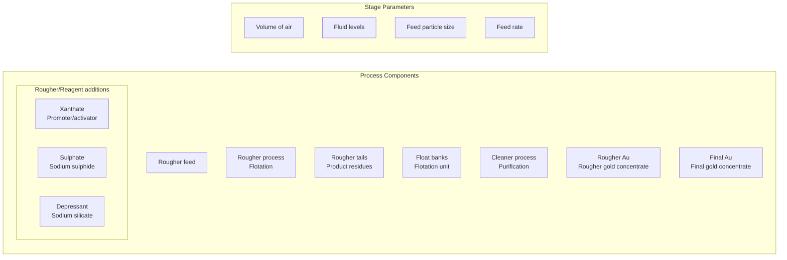
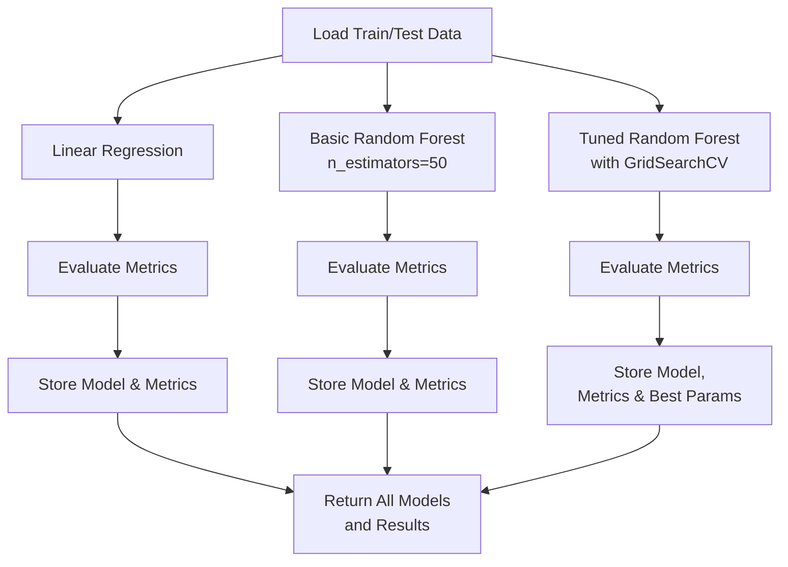

# Zyfra - Optimizing Gold Recovery

## Site
[Zyfra - Gold Recovery Optimization](https://umbertofasci.github.io/Projects/OptimizingGoldRecovery.html)

## Experiments


Have a look at the **[Zyfra RF MLflow Experiment](https://github.com/users/UmbertoFasci/projects/9)** to keep track of MLflow implementation.

## Deployment


## Introduction


In the mining industry, extracting gold from ore is a complex process that requires multiple stages of purification and refinement. The efficiency of this process, measured by the recovery rate, which is crucial for both economic and environmental reasons. This project focuses on developing a machine learning model to predict the recovery rate of gold during the purification process, using data collected from various stages of a gold recovery plant.

The dataset encompasses multiple parameters measured throughout the technological process, including concentrations of different metals (Au, Ag, Pb), particle sizes, and various other features recorded at different stages of purification. These measurements are time-stamped, creating a temporal dimension to our analysis that could reveal important patterns in the recovery process.

The primary objective is to create a model that can accurately predict the recovery rate of gold, which will help optimize the purification process and reduce production costs.

The project's success will be measured using the Symmetric Mean Absolute Percentage Error (sMAPE), providing a balanced assessment of our model's predictive capabilities.


## Technological Process

In order to develop a proper workflow for optimization we must first understand what is to be optimized. In this case, understanding the technological process of gold extraction is essential.
Mined ore undergoes primary processing to get the ore mixture or rougher feed, which is the raw material for ploatation (also known as the rougher process). After flotation, the material is
sent to a two-stage purification.
<div align="center">

</div>
### Flotation
- Gold ore mixture is fed into the float banks to obtain rougher Au concentrate and roughter `tails` (product residues with low concentration of valuable metals).
- The stability of this process is affected by the volatile and non-optimal physicochemical state of the `flotation pulp` (a mixture of solid particles and liquid). 

### Purification
- The rougher concentrate undergoes two stages of purification. After purification, the final concentrate and new tails is obtained.

### Staging & Process Components

Below are the staging and processing components associated with the technological process, these compnents are utilized as features in the final dataset.


## Data Description

Given the technological process which the features originate from they are named in the following format:

```
[stage].[parameter_type].[parameter_name]
```
With this in mind we can take another look at the technological process where we can then infer the feature
names present in the dataset.
<div align="center">


    
| # | Feature Name |
|--------|------------|
| 1 | rougher.input.feed_au |
| 2 | rougher.output.tail_au |
| 3 | rougher.output.concentrate_au |
| 4 | primary_cleaner.output.tail_au |
| 5 | primary_cleaner.output.concentrate_au |
| 6 | secondary_cleaner.output.tail_au |
| 7 | final.tail_au |

</div>

## Recovery Calculation Function

In the procedure, the recovery calculation of the provided dataset is tested against one developed by myself. This is done after importing
and ingesting the data which came in three separate files: `gold_recovery_train.csv`, `gold_recovery_test.csv`, and `gold_recovery_full.csv`.

>[!NOTE]
> The downloaded data is straight from the source, and some parameters are not available becasue they were measured or calculated
> after the data was collected. That's why some features that are present in the training set may be absent from the test set. 

Now, continuing with the task at hand. The first objective with this dataset was to make sure that the recovery was calculated appropriately.
To do this, the following equation was used:

```math
Recovery = \frac{C \times (F - T)}{F \times (C - T)} \cdot 100\%
```

Where,


- $C$ — share of gold in the concentrate right after flotation (for finding the rougher concentrate recovery)/after purification (for finding the final concentrate recovery)
- $F$ — share of gold in the feed before flotation (for finding the rougher concentrate recovery)/in the concentrate right after flotation (for finding the final concentrate recovery)
- $T$ — share of gold in the rougher tails right after flotation (for finding the rougher concentrate recovery)/after purification (for finding the final concentrate recovery)

Calculating the recovery in python can be achieved with:
```python
def calculate_recovery(row, concentration_col, feed_col, tails_col):
    C = row[concentration_col]
    F = row[feed_col]
    T = row[tails_col]
    
    # Avoid division by zero
    if F == 0 or (C - T) == 0:
        return 0
    
    recovery = C * (F - T) / (F * (C - T)) * 100
    
    # Handle edge cases
    if np.isnan(recovery) or np.isinf(recovery):
        return 0
    
    return recovery
```

Applying this function to the training set:
```python
train_df['calculated_recovery'] = train_df.apply(
    lambda row: calculate_recovery(
        row,
        'rougher.output.concentrate_au',  # C
        'rougher.input.feed_au',          # F
        'rougher.output.tail_au'          # T
    ),
    axis=1
)

```
Validating the recovery calculation:
```python
valid_recovery_mask = (~train_df['rougher.output.recovery'].isna()) & (~train_df['calculated_recovery'].isna())

mae = mean_absolute_error(
    train_df.loc[valid_recovery_mask, 'rougher.output.recovery'],
    train_df.loc[valid_recovery_mask, 'calculated_recovery']

)
```
>[!NOTE]
> The `valid_recovery_mask` is created as a way to only include values that are not missing and to avoid any errors.
> Keep in mind this is being done before any initial data processing. 

### Recovery Calculation Results

The Mean Absolute Error between the calculated and the actual recovery values was found to be **`9.30e-15`**.
Considering this extremely low MAE value, effectively zero, we confirmed that the implementation of the recovery formula
matches the existing calculations in the dataset.

This near-zero difference validates both our understanding of the recovery calculation process and the reliability of
the provided data, ensuring a solid foundation for subsequent modeling efforts.

## Missing Features & Values

### Missing Test Features

To better describe what features are missing in the provided test set here is a complete list of the missing 35 features.

<details>
<summary>Click to view all missing features</summary>
    
- final.output.concentrate_ag (Type: float64)
- primary_cleaner.output.tail_pb (Type: float64)
- rougher.calculation.floatbank11_sulfate_to_au_feed (Type: float64)
- rougher.calculation.floatbank10_sulfate_to_au_feed (Type: float64)
- rougher.output.tail_sol (Type: float64)
- rougher.output.concentrate_sol (Type: float64)
- final.output.tail_ag (Type: float64)
- primary_cleaner.output.concentrate_ag (Type: float64)
- rougher.calculation.sulfate_to_au_concentrate (Type: float64)
- rougher.output.tail_pb (Type: float64)
- primary_cleaner.output.tail_ag (Type: float64)
- calculated_recovery (Type: float64)
- rougher.calculation.au_pb_ratio (Type: float64)
- secondary_cleaner.output.tail_sol (Type: float64)
- secondary_cleaner.output.tail_au (Type: float64)
- secondary_cleaner.output.tail_pb (Type: float64)
- primary_cleaner.output.concentrate_sol (Type: float64)
- final.output.concentrate_sol (Type: float64)
- primary_cleaner.output.tail_au (Type: float64)
- final.output.tail_sol (Type: float64)
- rougher.output.recovery (Type: float64)
- primary_cleaner.output.concentrate_au (Type: float64)
- rougher.output.concentrate_au (Type: float64)
- rougher.output.tail_ag (Type: float64)
- final.output.concentrate_pb (Type: float64)
- final.output.concentrate_au (Type: float64)
- final.output.tail_au (Type: float64)
- rougher.output.concentrate_ag (Type: float64)
- primary_cleaner.output.concentrate_pb (Type: float64)
- secondary_cleaner.output.tail_ag (Type: float64)
- rougher.output.concentrate_pb (Type: float64)
- rougher.output.tail_au (Type: float64)
- final.output.recovery (Type: float64)
- final.output.tail_pb (Type: float64)
- primary_cleaner.output.tail_sol (Type: float64)

</details>

An easy way to obtain this list of missing features in the test set that are present in the training is to utilize the `set()` functionality:

```python
train_columns = set(train_df.columns)
test_columns = set(test_df.columns)

missing_in_test = train_columns - test_columns
```

### Missing Values

Here we highlight the inherent challenges in industrial process data collection. The training set exhibits 85 columns with missing values, with significant gaps in final output measurements
and recovery data, notably 1,521 missing values in final output recovery. State measurements such as floatbank levels and air parameters show consistent patterns of 85 - 103 mising entries.
The test set demonstrates a more extensive pattern of missing values, particularly in input and state parameters. While floatbank state measurements chonsistently express around 16 missing
values, chemical input measurements display higher variability in missing data, randing from 166 to 353 missing values for xanthate measurements and up to 302 for sulfate readings. Feed
measurements also show varying degrees of missingness across different parameters.

### Missing Data Imputation

#### Bi-Directional Rolling Average Interpolation

In this section an experiment in filling time-series-like data is performed targeting several methodologies and data leakage. While dropping the values was
an option, at this point I wanted to try and maintain the temporal effects of the dataset. The first approach that was made was to conduct a **rolling average interpolation**.
This interpolation formula creates a bidirectional moving average by computing both forward and backward rolling means with a specified window size, then averages these two
directions to produce more balanced estimates.

```math
Combined \ \ Average(t) = \frac{1}{2} (\frac{\sum_{i=t}^{t+w} X_{i}}{w} + \frac{\sum_{i=t-w}^{t} X_{i}}{w})
```
where,

- $w$ — window size
- $t$ — current time point
- $X_{i}$ — value at time i

This is performed in python:

```python
def rolling_average_interpolate(series, window):
    # Create forward and backward rolling means
    forward_roll = series.rolling(window=window, min_periods=1).mean()
    backward_roll = series[::-1].rolling(window=window, min_periods=1).mean()[::-1]
    
    # Combine forward and backward rolls
    combined_roll = (forward_roll + backward_roll) / 2
    
    # Only fill the NaN values in the original series
    result = series.copy()
    result[series.isna()] = combined_roll[series.isna()]
    return result
```
#### Fill Comparison

To compare the performance of the bi-directional rolling average interpolation procedure, performing a simple forward &rarr; backward fill procedure acts as the compartive method.


Having a look at one feature distribution comparing the different fill methods exposes the forward and backward fill process as a zero generator.
> [!IMPORTANT]
>This implies that a considerable amount of present zero values are followed by a missing value.

Importantly, the rolling average procedure better maintained the distribution of the data.
This can also be seen when having a look at another feature distribution comparing the same methods:


#### Fill Comparison - Model Performance

To get a descent picture of how these filling methods truly perform in the context of modeling, a test modeling procedure is constructed in order to ascertain a more informed approach to deciding
what processed dataset to utilize. For this model performance comparison an ensemble fill procedure utilizing the bi-directional rolling average and forward + backward fill was considered. After considering
potential data leakage issues this ensemble method was also tested while excluding the backward fill procedure. The main comparison will be a baseline drop NaN procedure.

Testing these missing value handling methods was performed with a **Random Forest Regressor** model, and resulted in the following:

For the `rougher.output.recovery`:

- The filled approach performed slightly better with an MAE of 8.78 compared to the baseline’s 9.05.
- Notably, the filled approach also showed more consistent performance with a lower standard deviation (0.76 vs 1.67), suggesting more stable predictions.
- This indicates that for rougher output recovery, the additional data points and filling strategy are beneficial.

However, for the `final.output.recovery`:

- The baseline approach significantly outperformed the filled approach (MAE 6.47 vs 8.05).
- The baseline also showed better stability with a lower standard deviation (0.98 vs 1.44).
- This suggests that for final recovery, using only complete cases leads to more accurate predictions.

Given the overall performance of the missing value handling methods, and the desire to maintain whichever temporal effects that exist in the dataset. It was decided to continue with
the bi-directional rolling average + forward fill (remaining missing) methods in order to not only maintain the temporal effects but to maintain the general density distribution
of the present features.

>[!NOTE]
>_The inclusion or exclusion of the backward fill method did not affect the model performance in any way._

## Analysis

The analysis of the given dataset will focus on three factors: metal concentration change through the main stages of the technological processes, particle size
distribution comparisons between provided training and testing datasets. and concentration distributions by stage.

### Metal Concentration


The concentration changes of gold (AU), silver (AG), and lead (PB) are illustrated here throughout different stages of the earlier described technological process.
Gold demonstrates the most significant enrichment, starting at 7.1 in the raw feed, increasing by 142.7% to 17.4 in the rougher concentrate, and finally
reaching 39.4 in the final concentrate, marking a total increase of 127%.

Silver shows a different pattern, initially increasing by 35.1% from 7.8 to 10.5 in the rougher concentrate, but then decreasing significantly by 55.4% to 4.7 in the
final concentrate.

Lead follows a steady upward trend, starting at 3.2 in the raw feed, increasing by 114.3% to 6.9 in the rougher concentrate, and finally reaching 9.1 in the final
concentrate, showing a 32.5% increase in the final stage.

These patterns reveal that the purification process is most effective for gold concentration while having varying effects on silver and lead, with silver notably being
reduced in the final stage.

> [!NOTE]
> The primary takeaway from this metal concentration analysis is that the technological purification procedure is most likely targeting gold concentration enrichment.
> When knowing the source of the data, this is absolutely the case. In this way, this can be a supportive analysis to the present refining procedures.


| Metal | Raw Concentration | Final Concentration | 
|--------|------------|------------|
| Gold | `7.1` | `39.4` |
| Silver | `7.8` | `4.7` |
| Lead | `3.2` | `9.1` |


### Particle Size

The analysis of particle size distributions between training and test datasets reveals a consistent bimodal pattern across both sets, characterized by a sharp,
concentrated peak for primary cleaner input near size 0 (indicating finely ground particles) and a broader, lower distribution for rougher input centered around
size 50 (suggesting more varied particle sizes). This visual consistency in distribution patterns between training and test sets suggests overall stability in the
grinding and classification processes.


While the size distribution between the sets may look the same visually, we can statistically ascertain just how similar these distributions are between each other.
For the purposes of this use-case the **Kolmogorov-Smirnov Test** or **KS Test** is applied. The KS test is a non-parametric and distribution-free test, meaning
it makes no assumption about the distribution of data. By utilizing this test, we can compare these dsitributions appropriately and determine if they are significantly
different.

<div align="center">

**Kolmogorov-Smirnov Test**

| Feature | KS statistic | p-value | 
|--------|------------|------------|
| primary_cleaner.input.feed_size | `0.0520` | `1.202248e-10` |
| rougher.input.feed_size | `0.1935` | `5.994895e-143` |
</div>

The KS test results indicate statistically significant differences between the training and test distributions, with p-values well below the **0.05** threshold for both measurements.
The primary cleaner input shows better alignment between sets with a lower KS statistic of **0.0520**, compared to the rougher input's higher statistic. WHile these differences are
statistcally different, the relatively small KS statistic suggests that these variations are unlikely to substantially impact the model's predictive performance, they they should be
considered during model evaluation and interpretation.

# Helper Functions

The following is a collection of all the helper functions used for preparing the features, calculation sMAPE/final sMAPE, implemtning modeling/optimization, and evaluation procedures.

## Feature Preparation

For this section three main tasks must be performed: feature selection, alignment, and standardization. First, relevant features related to feed characteristics were selected.
These features include: particle size, concentration, state, and floatbank parameters while excluding target variables (recovery rates).

> [!NOTE]
> When a test dataset is provided, it ensures feature consistency by keeping only columns present in both training and test sets. This is where feature "alignment" takes place.

The third portion of the feature preparation procedure standardizes the numerical features using `StandardScalar()` to normalize the data scale. To impliment this
in python, a single function can be created:

```python
def prepare_features(train_df, test_df=None):
    # Select relevant numerical features from training data
    feature_columns = [col for col in train_df.columns if any(x in col for x in [ 
        'feed', 'particle_size', 'concentration', 'state', 'floatbank'])]
    
    # Remove target columns
    target_columns = ['rougher.output.recovery', 'final.output.recovery']
    feature_columns = [col for col in feature_columns if col not in target_columns]
    
    # Only keep features present in both datasets
    if test_df is not None:
        feature_columns = [col for col in feature_columns if col in test_df.columns]
        print(f"Number of aligned features: {len(feature_columns)}")
    
    X_train = train_df[feature_columns]
    
    # Scale features
    scaler = StandardScaler()
    X_train_scaled = scaler.fit_transform(X_train)
    
    if test_df is not None:
        X_test = test_df[feature_columns]
        X_test_scaled = scaler.transform(X_test)
        return X_train_scaled, X_test_scaled, feature_columns, scaler
    
    return X_train_scaled, feature_columns, scaler
```

## sMAPE Calculation

The Symmetric Mean Absolute Percentage Error (sMAPE) is implemented here as a robust metric for evaluating the gold recovery prediction model’s performance. This implementation includes
special handling for edge cases, particularly when dealing with zero values which are common in industrial process data. The function calculates the percentage error by taking the
absolute difference between predicted and actual values (numerator) and dividing it by the average of their absolute values (denominator), then multiplying by 100 to express it as a percentage.

```math
sMAPE = \frac{1}{N} \sum_{i=1}^{N} \frac{| y_{i} - \hat{y}_{i}|}{(|y_{i}| + |\hat{y}_{i}|)/2} \times 100\%
```
The symmetrical nature of sMAPE makes it particularly suitable for our gold recovery predictions because it treats over-predictions and under-predictions equally, which is crucial when optimizing recovery processes where both types of errors can be costly. The function includes safeguards against division by zero and handles invalid cases gracefully, returning 0 when no valid calculations can be made. This is especially important in industrial applications where we need reliable error measurements to make operational decisions about the recovery process.

This sMAPE implimentation can be done using a simple python function:

```python
def calculate_smape(y_true, y_pred):
    # Convert inputs to numpy arrays
    y_true = np.array(y_true)
    y_pred = np.array(y_pred)
    
    # Handle cases where both true and predicted values are 0
    denominator = (np.abs(y_true) + np.abs(y_pred)) / 2
    
    # Create a mask for valid entries (non-zero denominator)
    valid_mask = denominator != 0
    
    if not np.any(valid_mask):
        return 0.0  # Return 0 if all denominators are 0
    
    # Calculate sMAPE only for valid entries
    numerator = np.abs(y_true - y_pred)
    smape = np.mean(np.divide(numerator[valid_mask], denominator[valid_mask])) * 100
    
    return smape
```

## Final sMAPE Calculation

The final sMAPE is specifically designed for the gold recovery process, coombining error measurements from both the rougher and final recovery stages.
The function calculates the individual sMAPE values for each stage and then applies a weighted average where the rougher stage contributes 25% nad the
final stage contribues 75% to the overall score. This weighting reflects the greater importance of accuracy in the final recovery stage, which directly
impacts the end product quality.

```math
Final \ \ sMAPE = 25\% \times sMAPE(rougher) + 75\% \times sMAPE(final)
```

This is formulated in a python function which also provides diagnostic information, displaying the range of the true and predicted values for both stages
along with their individual sMAPE scores, which helps in understanding where prediction errors are occurring and their relative magnitudes. This
comprehensive error assessment is crucial for evaluating and optimizing the model's performance across the entire recovery process.

```python
def calculate_final_smape(y_true_rougher, y_pred_rougher, y_true_final, y_pred_final):
    rougher_smape = calculate_smape(y_true_rougher, y_pred_rougher)
    final_smape = calculate_smape(y_true_final, y_pred_final)
    
    # Print sNAPE information
    print(f"Rougher sMAPE components:")
    print(f"  Range of true values: [{np.min(y_true_rougher):.2f}, {np.max(y_true_rougher):.2f}]")
    print(f"  Range of predicted values: [{np.min(y_pred_rougher):.2f}, {np.max(y_pred_rougher):.2f}]")
    print(f"  Calculated rougher sMAPE: {rougher_smape:.2f}")
    
    print(f"\nFinal sMAPE components:")
    print(f"  Range of true values: [{np.min(y_true_final):.2f}, {np.max(y_true_final):.2f}]")
    print(f"  Range of predicted values: [{np.min(y_pred_final):.2f}, {np.max(y_pred_final):.2f}]")
    print(f"  Calculated final sMAPE: {final_smape:.2f}")
    
    return 0.25 * rougher_smape + 0.75 * final_smape
```
## Model Evaluation

Here Mean Absolute Error and sMAPE metrics are prepared to handle model evaluation. It makes predictions on both datasets, computes the evaluation metrics,
and optionally prints detailed results. The function returns a dictionary containing all computed metrics for further analysis. Additionally, verbosity is
implemented as a parameter option since all metric results are stored.

```python
# Model Evaluation Functions
def evaluate_model(model, X_train, X_test, y_train, y_test, model_name="", verbose=True):
    # Make predictions
    train_pred = model.predict(X_train)
    test_pred = model.predict(X_test)
    
    # Calculate metrics
    train_mae = mean_absolute_error(y_train, train_pred)
    test_mae = mean_absolute_error(y_test, test_pred)
    train_smape = calculate_smape(y_train, train_pred)
    test_smape = calculate_smape(y_test, test_pred)
    
    if verbose:
        print(f"\n{model_name} Evaluation Results:")
        print("-" * 40)
        print(f"Training MAE: {train_mae:.4f}")
        print(f"Test MAE: {test_mae:.4f}")
        print(f"Training sMAPE: {train_smape:.4f}")
        print(f"Test sMAPE: {test_smape:.4f}")
        
    return {
        'train_mae': train_mae,
        'test_mae': test_mae,
        'train_smape': train_smape,
        'test_smape': test_smape
    }
```

## Cross-Validation Implimentation

Here, a cross-validation procedure is defined, and returns both the mean and standard deviation of cross-validation scores, providing insight into model
consistency across different data subsets.

```python
def perform_cross_validation(model, X, y, cv=5):
    cv_scores = cross_val_score(model, X, y, cv=cv, scoring='neg_mean_absolute_error')
    cv_scores = -cv_scores  # Convert negative MAE to positive
    return cv_scores.mean(), cv_scores.std()
```

## Random Forest Optimization

Hyperparameter optimization for the **Random Forest Regressor** model is defined utilizing `GridSearchCV` to systematically explore different
combinations of key parameters. It explores four hyperparameters: number of trees (30-200), maximum tree depth (10-30), minimum samples for
splitting nodes (5), and minimum samples per leaf (2). The optimization process uses 3-fold cross-validation with negative means absolute
error as the scoirng metric. The best performing model configuration is returned.

```python
def tune_random_forest_optimized(X_train, X_test, y_train, y_test):
    param_grid = {
        'n_estimators': [30, 50, 100, 200],
        'max_depth': [10, 20, 30],
        'min_samples_split': [5],
        'min_samples_leaf': [2]
    }
    
    base_rf = RandomForestRegressor(random_state=42, n_jobs=-1)
    grid_search = GridSearchCV(
        base_rf,
        param_grid,
        cv=3,
        scoring='neg_mean_absolute_error',
        n_jobs=-1
    )
    
    grid_search.fit(X_train, y_train)
    return grid_search.best_estimator_, grid_search.best_params_
```

## Modeling Function

Here the main modeling procedure is defined where three separate models will be trained: Linear Regression, Random Forest, and a Tuned Random Forest.
The linear regression model acts as a baseline to compare model performance. The tuned random forest model represents the most sophisticated approach,
incorporating optimal hyperparameters.

```python
def build_and_evaluate_models_optimized(X_train, X_test, y_train, y_test):
    models = {}
    
    # Linear Regression
    print("Training Linear Regression...")
    lr_model = LinearRegression()
    lr_model.fit(X_train, y_train)
    lr_metrics = evaluate_model(lr_model, X_train, X_test, y_train, y_test, "Linear Regression")
    models['linear_regression'] = {'model': lr_model, 'metrics': lr_metrics}
    
    # Basic Random Forest
    print("Training Basic Random Forest...")
    rf_model = RandomForestRegressor(n_estimators=50, random_state=12345, n_jobs=-1)
    rf_model.fit(X_train, y_train)
    rf_metrics = evaluate_model(rf_model, X_train, X_test, y_train, y_test, "Basic Random Forest")
    models['basic_rf'] = {'model': rf_model, 'metrics': rf_metrics}
    
    # Tuned Random Forest
    print("Training Tuned Random Forest...")
    best_rf, best_params = tune_random_forest_optimized(X_train, X_test, y_train, y_test)
    tuned_rf_metrics = evaluate_model(best_rf, X_train, X_test, y_train, y_test, "Tuned Random Forest")
    models['tuned_rf'] = {
        'model': best_rf,
        'metrics': tuned_rf_metrics,
        'best_params': best_params
    }
    
    return models
```

Here is the same modeling procedure represented as a diagram:


# Modeling Procedure

## Data Preparation
The data preparation phase for the gold recovery prediction model involves a comprehensive preprocessing approach that successfully aligns 49 features between the training and test datasets. The process begins with feature scaling and preparation through the `prepare_features` function, which ensures consistent feature representation across datasets. Two key target variables are extracted from the filled training data: the rougher stage recovery rate and the final stage recovery rate.

The data is then partitioned using an 80-20 train-validation split with a fixed random state. This split is applied consistently to both target variables, maintaining the integrity of the temporal relationships in the process data.
```python
# Prepare features and targets
X_train_scaled, X_test_scaled, feature_columns, scaler = prepare_features(
    filled_train_df, filled_test_df)

# Prepare targets
y_train_rougher = filled_train_df['rougher.output.recovery']
y_train_final = filled_train_df['final.output.recovery']

# Split data
X_train, X_val, y_train_rougher, y_val_rougher = train_test_split(
    X_train_scaled, y_train_rougher, test_size=0.2, random_state=12345)
_, _, y_train_final, y_val_final = train_test_split(
    X_train_scaled, y_train_final, test_size=0.2, random_state=12345)
```
With the features prepared, a more manageable subset is created to significantly reduce the computational time during the initial model development and tuning phases.
```python
# Sample the data, reduce training time.
sample_size = 6000
sample_indices = np.random.choice(len(X_train), sample_size, replace=False)

X_train_sample = X_train[sample_indices]
y_train_rougher_sample = y_train_rougher.iloc[sample_indices]
y_train_final_sample = y_train_final.iloc[sample_indices]
```
The sampling is applied consistently across both feature matrix (X_train) and target variables (rougher and final recovery rates), preserving the relationships between inputs and outputs. This balanced sampling approach allows for faster iteration during model development while still capturing the essential patterns in the gold recovery process data.

## Final Modeling

Conducting the final modeling step is as simple as running the previously defined functions.
```python
# Train models
print("\nTraining models for rougher recovery:")
rougher_models = build_and_evaluate_models_optimized(
    X_train_sample, X_val, 
    y_train_rougher_sample, y_val_rougher
)


print("\nTraining models for final recovery:")
final_models = build_and_evaluate_models_optimized(
    X_train_sample, X_val, 
    y_train_final_sample, y_val_final
)
```
For the rougher recovery stage, Linear Regression showed consistent but modest performance with training/test MAE around 6.7-6.9 and sMAPE around 10.4-10.6%. Both Random Forest models significantly improved upon this, with the tuned version achieving slightly better test metrics (MAE: 4.25, sMAPE: 8.04%) compared to the basic version. Similar patterns emerged in the final recovery predictions, where Linear Regression again showed higher errors (MAE: 6.3-6.7, sMAPE: 10.3-10.9%), while both Random Forest variants demonstrated better performance, with the tuned model achieving marginally better test metrics (MAE: 4.64, sMAPE: 8.05%). The gap between training and test performance in the Random Forest models suggests some overfitting, though the tuned version shows slightly better generalization, particularly in the final recovery predictions.

<div align="center">

</div>

## Final sMAPE

<div align="center">

</div>

The Linear Regression model showed the highest combined sMAPE of 10.89%, with prediction ranges exceeding the true value bounds, indicating potential overestimation issues. The Basic Random Forest improved significantly with a combined sMAPE of 8.23%, while the Tuned Random Forest achieved the best performance with a combined sMAPE of 8.05%. The prediction ranges for both Random Forest models stayed closer to the actual value range of 0-100%, suggesting better calibrated predictions. The tuned model’s marginally better performance and more conservative prediction ranges make it the most suitable choice for the gold recovery prediction task, balancing accuracy with prediction reliability.

The final results summary reveals the optimal configurations and comparative performance metrics across all models. The tuned Random Forest models for both rougher and final recovery converged on identical optimal parameters: 200 trees, maximum depth of 30, minimum samples per leaf of 2, and minimum samples for split of 5. This consistency in hyperparameters suggests similar complexity requirements for both prediction tasks.

Linear Regression showed consistent but higher error rates (MAE ~6.3-6.9, sMAPE ~10.3-11.0%) across both recovery stages. Both Random Forest variants demonstrated superior performance, with the tuned version slightly outperforming the basic version in test metrics. The tuned model achieved test MAE of 4.25 and sMAPE of 8.04% for rougher recovery, and test MAE of 4.65 and sMAPE of 8.05% for final recovery. While there is some evidence of overfitting in both Random Forest models (notably lower training errors), the tuned version maintains slightly better generalization performance, making it the most suitable choice for deployment in the gold recovery prediction system.

# Conclusion
Based on the analysis and modeling of the gold recovery process data, we can draw several key conclusions about the optimal approach to predicting recovery efficiency. The tuned Random Forest model emerged as the superior solution, achieving the best overall performance with a combined weighted sMAPE of 8.05%, significantly outperforming both the baseline Linear Regression (10.90%) and the basic Random Forest (8.23%). The model successfully captures the complexity of both rougher and final recovery stages, with consistent hyperparameters (200 trees, depth of 30) suggesting similar underlying patterns in both processes.

The model evaluation revealed important insights about the process itself: the concentration patterns showed expected enrichment of gold through the stages, particle size distributions remained consistent between training and test sets despite statistical differences, and the careful handling of missing values through rolling average interpolation preserved the temporal characteristics of the data. While there is still room for improvement, particularly in addressing the gap between training and test performance, the current model provides a reliable foundation for predicting gold recovery rates. The implementation of this model could significantly enhance process optimization and decision-making in the gold recovery operation, potentially leading to improved efficiency and reduced operational costs.
